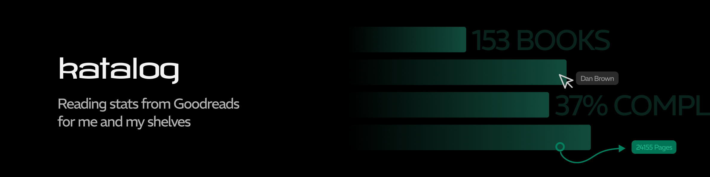

# katalog

A comprehensive Goodreads data scraper and analytics dashboard that automatically tracks reading activity, provides detailed statistics, and visualizes reading habits over time.

## Overview

Katalog consists of two main components:

- **Python scraper** - A robust web scraper that extracts Goodreads data (books, shelves, feed activity, reading challenges) and stores it in Supabase
- **Next.js dashboard** - A clean web dashboard that visualizes reading statistics and social feed activity

The scraper runs on a schedule (via cron job) to keep data fresh, while the dashboard provides insights into my reading patterns.

## Prerequisites

- Python 3.9+
- Node.js 18+
- Docker (optional, for containerized dev/deployment)
- Supabase account (for data storage)
- Goodreads account with valid session cookie

## Initial Configuration

### Scraper Environment Variables

Create a `.env` file in the root directory:

```env
# Goodreads Authentication
GOODREADS_COOKIE=your_cookie_string_here
GOODREADS_USER_ID=your_user_id_here

# Database
SUPABASE_URL=https://your-project.supabase.co
SUPABASE_KEY=your_supabase_anon_key

# Environment
ENVIRONMENT=dev  # or 'production'

# Monitoring (if you'd like that in production)
SENTRY_DSN=https://xxxxx@sentry.io/yyyy
```

#### Getting Your Goodreads Cookie

- Log into Goodreads in your browser
- Open Developer Tools (F12)
- Go to the Network tab
- Refresh the page
- Make any request to `goodreads.com`
- Copy the entire `Cookie` header value from the Request Headers

### Client Environment Variables

Create a `.env` file in the `client/` directory:

```env
NEXT_PUBLIC_SUPABASE_URL=https://your-project.supabase.co
NEXT_PUBLIC_SUPABASE_ANON_KEY=your_supabase_anon_key
```

## Database Setup

The scraper expects the following Supabase tables: `books`, `feed`, `metadata`, `reading_challenge`.

## Local Development

### Manual setup

- **Clone the repository**
   ```bash
   git clone <repository-url>
   cd katalog
   ```

- **Set up Python environment**
   ```bash
   python -m venv venv
   source venv/bin/activate  # On Windows: venv\Scripts\activate
   chmod +x scripts/install.sh
   ./scripts/install.sh
   ```

- **Configure environment variables**
   ```bash
   cp .example.env .env
   # Edit .env with credentials
   ```

- **Set up the client**
   ```bash
   cd client
   npm install
   cp .example.env .env
   # Edit .env with credentials
   ```

### Setup via Docker

- **Build with Docker**
   ```bash
   docker build -t katalog .
   ```

## Usage

### Running the Scraper

**Local execution**
```bash
source venv/bin/activate
python src/index.py
```

**Docker execution**
```bash
docker run --rm --env-file .env -v "$(pwd)/output":/app/output katalog

###
# Alternatively, you could just run ./scripts/build.sh
###
```

### Running the Dashboard

```bash
cd client
npm run dev
```

Visit `http://localhost:3000` to view the dashboard.

## Data Flow

- **Scheduled Trigger**: Cron job triggers the scraper
- **Session Verification**: Validates Goodreads cookie is still valid
- **Data Extraction**:
   - Feed activity scraped via Playwright (JavaScript-rendered content)
   - Books data scraped via requests library (static HTML)
   - Reading challenge fetched from Goodreads API
- **Data Validation**: All data validated against Pydantic schemas
- **Health Checks**: Ensures data was actually scraped (not empty due to selector changes)
- **Database Sync**:
   - Books: Upserted (updates existing, inserts new)
   - Feed: Only new items inserted (based on high-water mark)
   - Challenge: Upserted with latest progress
- **Metadata Update**: Updates `last_refreshed` and `next_scrape` timestamps
- **Dashboard**: Reads from Supabase during build time and renders visualizations

## Logging

### Development
- Logs written to `kata.log` in the project root
- Console output also displayed
- Debug level verbosity

### Production
- Logs sent to stderr (captured by Render in my case)
- Sentry integration for error tracking
- Info level verbosity

## Error Handling

The scraper includes robust error handling:

- **Session Validation**: Fails fast if Goodreads cookie is invalid
- **Health Checks**: Exits with error if no books are scraped (indicates selector breakage)
- **Partial Failures**: Continues scraping even if individual items fail validation
- **Retry Logic**: Uses exponential backoff for network requests
- **Graceful Degradation**: Empty feed is logged as warning (not fatal error)

## Deployment

I chose to put everything on Render.

### Scraper Deployment (Docker)
- Create new cron job and select Docker as the source
- Set environment variables as required
- Schedule the job to run every 3 days

### Dashboard Deployment
- Create a new static site and choose `client` as the base folder
- For the build command, put `npm ci && npm run build`
- The output directory should be `dist`

>[!NOTE] 
> This scraper is built for my personal use only. Please get in touch if you feel this can be useful for you as well.
